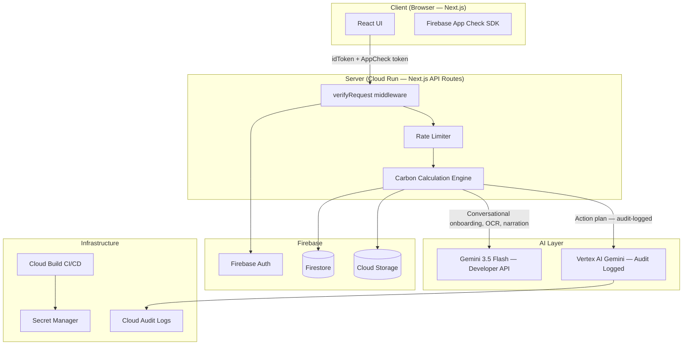

# 🌍 CarbonTrace AI
> AI-powered carbon footprint tracker built with Google's full AI stack.

---

## 🎯 Chosen Vertical

**Climate Tech / Sustainability — Individual Carbon Footprint Reduction**

Carbon emissions are one of the defining challenges of our era, yet the individual's role remains
poorly understood and even more poorly acted upon. CarbonTrace AI sits at the intersection of
**behavioural science and generative AI**, targeting the gap between awareness and action.

The target user is any digitally connected individual who knows climate change is real but has
no accessible, personalised, or actionable way to understand their own contribution — or what
to do about it. Unlike enterprise carbon accounting tools, or generic calculator websites,
CarbonTrace AI is designed to be a **daily companion**, not a one-time survey.

---

## 🧠 Approach & Logic

Most existing carbon apps fail for the same reasons: long form-based onboarding, generic
one-size-fits-all tips, and no mechanism for genuine behaviour change over time. CarbonTrace AI
was built around three design principles that directly counter these failures.

**1. Conversation over Forms**
The onboarding is a Gemini-powered chat, not a 40-field survey. Gemini extracts a structured
carbon profile from natural conversation using function calling — users provide the same data
but in a way that feels human and low-friction. A user who would abandon a form at question 8
will answer 6 conversational questions without noticing.

**2. Insight Ranked by Personal Impact, Not General Advice**
The action plan is generated by Vertex AI with the user's full profile as context. Actions are
ranked by annual CO₂e saving *for that specific user* — not a generic list of "turn off lights
and eat less meat." Someone who doesn't own a car will never be told to buy an EV. Someone
already vegan won't be told to reduce beef.

**3. Simulate Before Committing**
Behaviour change research consistently shows that people are more likely to act when they can
mentally rehearse the outcome. The what-if simulator lets users drag a slider (e.g. "2 fewer
flights per year") and instantly see the impact in kg CO₂e, with Gemini narrating the result in
relatable human terms — before they commit to anything.

The underlying carbon calculation engine uses published emission factors from the IPCC, DEFRA
(UK), and EPA (US), calibrated by the user's country-level electricity grid emission factor.
All computation is deterministic and runs server-side; AI is layered on top for language,
personalisation, and narration — not for the maths.

---

## ⚙️ How the Solution Works

### User Journey

```
1. LOGIN            Google Sign-In (Firebase Auth) — one click, zero friction

2. ONBOARD          Gemini 3.5 Flash chat asks 6 lifestyle questions.
                    Function calling extracts a structured UserProfile JSON.
                    Carbon score computed immediately.

3. DASHBOARD        Animated score ring (kg CO₂e/year) + category breakdown
                    (Transport, Energy, Food, Shopping, Waste).
                    Compared to national average and the 1.5°C target (2,300 kg).

4. SCAN             Upload a photo of a utility bill.
                    Gemini Vision extracts kWh used and billing period.
                    Carbon contribution auto-logged for that month.

5. SIMULATE         Drag sliders for diet, car use, flights, electricity.
                    Score updates in real time (<500ms, no AI in hot path).
                    Click "Explain This" → Gemini narrates the delta in 3 sentences.

6. ACT              Vertex AI generates a personalised 5-action plan,
                    ranked by annual CO₂e saving for this user's profile.
                    Each action shows: saving, difficulty, cost impact, and
                    exactly why it applies to you.

7. TRACK            Log weekly updates (manual or via bill scan).
                    Line chart shows CO₂e trend over time.
                    Streak counter rewards consistent improvement.
```

### Data & AI Flow

```
User Input (chat / upload / slider)
        │
        ▼
Next.js API Route  ──► verifyRequest()  ──► Firebase App Check + Auth
        │
        ├──► Carbon Calculator (deterministic, no AI)
        │         └── Emission factors × usage data = kg CO₂e
        │
        ├──► Gemini 3.5 Flash (conversational, OCR, narration)
        │         └── Developer API → Vertex AI fallback on rate-limit
        │
        └──► Vertex AI Gemini (insight generation, audit-logged)
                  └── Personalised action plan with full profile context
                            │
                            ▼
                    Firestore (user data, logs, cached insights)
                    Cloud Storage (bill images)
```

### Google Services — Specific Roles

| Service | Specific Role in CarbonTrace AI |
|---|---|
| **Antigravity 2.0** | Orchestrates three parallel subagents: `ocr-parse-agent` (bill scanning), `insight-agent` (action plan generation), and `digest-scheduler` (weekly email). Manages the full build and deploy pipeline via CLI. |
| **Gemini 3.5 Flash** | Powers the onboarding chat (function calling to extract profile), bill/receipt OCR (vision input), and the what-if simulation narrator. Used via the Gemini Developer API (primary path). |
| **Vertex AI** | Handles the personalised action plan generation specifically — this path is chosen because every inference call is audit-logged to Cloud Audit Logs, providing compliance-grade visibility into AI-generated recommendations. |
| **Firebase Auth + App Check** | Google Sign-In for frictionless authentication. App Check validates every API call originates from the legitimate app, blocking credential abuse and bot traffic. |
| **Firestore** | Stores user profiles, carbon logs, action histories, and 24-hour cached Vertex AI insights. Security rules enforce that users can only read or write their own documents. |
| **Cloud Storage** | Stores uploaded utility bill images under `users/{uid}/bills/`. Access is restricted by Firebase Storage rules to the uploading user only, with a 5MB file size cap. |
| **Cloud Run** | Hosts the Next.js application as a serverless container. Scales to zero between uses (zero cost at rest) and auto-scales under load. The service account follows least-privilege IAM. |
| **Firebase Studio** | Used to prototype and generate the initial project scaffold via the AI Studio Build tab. The Antigravity Agent provisioned Firestore, Auth, and the initial Cloud Run deployment automatically. |
| **Cloud Build** | CI/CD pipeline: lint → typecheck → unit tests (80% coverage gate) → Docker build → push to Artifact Registry → deploy to Cloud Run → smoke test. |
| **Secret Manager** | All API keys and service account credentials are stored here. No secrets are embedded in the codebase or Docker image. |

---

## 📐 Architecture



---

## 🔐 Security

- **Firebase App Check** on all AI endpoints — every request is verified as originating from the legitimate app, not a bot or credential-scrapers.
- **Server-side only Gemini calls** — the API key lives in Secret Manager, accessed by the Cloud Run service account. It never appears in the client bundle.
- **Firestore security rules** — users can read and write only their own document subtree. No cross-user data access is possible regardless of client-side manipulation.
- **Rate limiting** — 10 AI calls per user per minute, enforced via Firestore atomic transactions (works correctly across multiple Cloud Run instances, unlike in-memory maps).
- **Input sanitisation** — all API route inputs are validated with Zod schemas before processing. HTML is stripped from text fields. Numeric values are range-clamped.
- **IAM least privilege** — the Cloud Run service account holds only the roles it needs (`firebase.sdkAdminServiceAgent`, `aiplatform.user`). No owner or editor roles.
- **Secrets in Secret Manager** — no `.env` files in the Docker image. All secrets are injected at runtime via Cloud Run's Secret Manager integration.

---

## ♿ Accessibility

- **WCAG 2.1 AA compliant** throughout.
- Fully keyboard navigable — every feature is reachable and operable without a mouse.
- `aria-live="polite"` regions on the chat message list, score updates, and bill scan results so screen readers announce dynamic changes.
- `aria-label` on all icon buttons, chart containers, and score rings.
- `role="log"` on the onboarding chat; `aria-label` on the score ring describes the value in plain English for screen readers.
- Focus management: modals trap focus and restore it on close; chat auto-moves focus to the latest AI message.
- `prefers-reduced-motion` respected — all animations disabled when the OS setting is active.
- Colour contrast ≥ 4.5:1 for all text; UI component contrast ≥ 3:1. Carbon score categories also use distinct text labels and shapes, not colour alone.
- Screen reader tested with VoiceOver (macOS/iOS) and NVDA (Windows).

---

## 🧪 Testing

| Test Type | Tool | Target |
|---|---|---|
| Unit tests | Vitest | 80%+ line and branch coverage |
| Component tests | Vitest + Testing Library | Render, interaction, ARIA |
| API route tests | Vitest + mocked Gemini | Auth, validation, error handling |
| E2E tests | Playwright | Full onboarding, simulation, accessibility flows |
| Accessibility tests | axe-core + Playwright | Zero critical violations on all main pages |

```bash
npm run validate        # typecheck + lint + unit tests (full CI gate)
npm run test:coverage   # unit tests with coverage report
npm run test:e2e        # Playwright end-to-end suite
npm run test:a11y       # axe-core accessibility audit on all pages
```

---

## 🚀 Setup

```bash
# 1. Clone the repository
git clone https://github.com/your-org/carbontrace-ai.git
cd carbontrace-ai

# 2. Install dependencies
npm install

# 3. Configure environment variables
cp .env.example .env.local
# Fill in: GEMINI_API_KEY, GOOGLE_CLOUD_PROJECT, Firebase config values
# See .env.example for full list and documentation of each variable

# 4. Seed the demo user and sample data (optional but recommended)
npx tsx scripts/seed-demo.ts

# 5. Start the development server
npm run dev
# → http://localhost:3000

# 6. Run the full validation suite
npm run validate
```

**Cloud Run deployment** is handled automatically by Cloud Build on every push to `main`.
Manual trigger: `gcloud builds submit --config cloudbuild.yaml`

---

## 📊 Problem Alignment

The brief asks for a solution that helps individuals **understand**, **track**, and **reduce** their carbon footprint through **simple actions** and **personalised insights**. Every feature maps to one of those verbs:

| Brief Requirement | How CarbonTrace AI Delivers It |
|---|---|
| **Understand** | Gemini onboarding chat explains *your* footprint in plain language as it's built. The dashboard compares your score to your national average and the 1.5°C target, so the number has context. |
| **Track** | Utility bill scanner auto-logs energy usage. Manual logging takes under 30 seconds. The progress chart shows your CO₂e trend week by week. |
| **Reduce** | The Vertex AI action plan gives you the 5 highest-impact changes *for your specific profile*, ranked by annual saving. The what-if simulator lets you test changes before committing. |
| **Simple actions** | Every action card shows difficulty (Easy / Medium / Hard) and cost impact. The AI never recommends something that doesn't apply to you. |
| **Personalised insights** | The AI has your country, diet, transport habits, and energy use as context. Recommendations differ for a vegan cyclist in Paris versus a meat-eater who commutes by car in Houston. |

---

## 🔧 Assumptions Made

1. **Users have a stable internet connection.** The app is not designed for offline use. The what-if simulator's hot path is synchronous (no AI call), so it remains responsive on slow connections, but onboarding and bill scanning require network access.

2. **Emission factors are approximations, not certified audits.** The carbon calculation engine uses published factors from IPCC AR6, DEFRA, and EPA. These are the best available public data, but individual results will vary from a professionally audited carbon footprint. The app is calibrated for behavioural guidance, not regulatory reporting.

3. **One primary residence per user.** The energy model assumes a single home. Users with multiple properties or irregular living arrangements (e.g. frequent travel with hotel stays) will see less accurate energy figures.

4. **Country-level grid emission factors.** Electricity grid intensity is applied at the country level (e.g. 0.82 kg CO₂e/kWh for India, 0.23 for the UK). Sub-national variation (e.g. a user in a high-renewables state) is not currently modelled, which may overstate emissions for some users.

5. **Diet categories are self-reported proxies.** The five diet tiers (vegan → heavy meat) use average annual emission estimates. Actual food emissions depend on specific items, sourcing, food waste, and cooking method — none of which are captured at this level of detail.

6. **Google Sign-In is available.** The app uses Firebase Authentication with Google as the sole provider. Users without a Google account cannot currently sign in.

7. **Gemini 3.5 Flash is available in the deployment region.** The app targets `us-central1` on Cloud Run and assumes Gemini Developer API availability. The Vertex AI fallback handles rate-limit scenarios but not regional availability gaps.

8. **Bill images are machine-readable.** The Gemini Vision OCR works best with clear, digital utility bills. Heavily crumpled, handwritten, or very low-resolution images may fail extraction, in which case the user is prompted to enter data manually.

---

## 📄 Licence

MIT — see [LICENSE](LICENSE)
