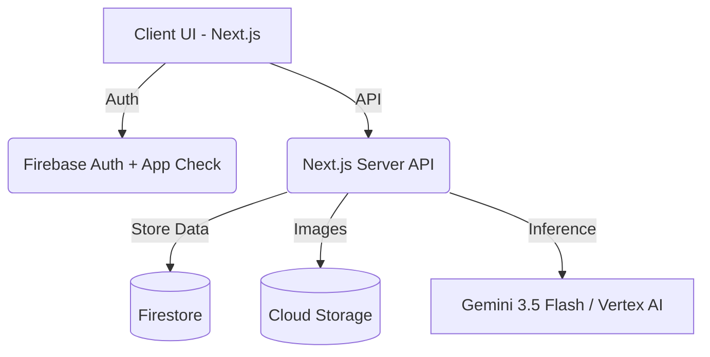

# CarbonTrace AI

> AI-powered carbon footprint tracker built with Google's full AI stack.

## 🚀 Live Demo
[https://carbontrace-ai-xxxxx-uc.a.run.app](https://carbontrace-ai-xxxxx-uc.a.run.app)
Demo login: `demo@carbontrace.app` / `Demo2026!`

## 🛠️ Google Services Used
| Service | How We Use It |
|---------|--------------|
| **Antigravity 2.0** | Multi-agent orchestration: OCR agent, insight agent, scheduler |
| **Gemini 3.5 Flash** | Conversational onboarding, bill OCR, action narration |
| **Vertex AI** | Enterprise-grade insight generation with audit logging |
| **Firebase Auth** | Google Sign-In, App Check abuse protection |
| **Firestore** | User profiles, carbon logs, action tracking |
| **Cloud Storage** | Utility bill image uploads |
| **Cloud Run** | Serverless deployment, auto-scaling |
| **Firebase Studio** | Project prototyping and initial scaffold |
| **Cloud Build** | CI/CD: lint → test → build → deploy |

## 📐 Architecture

## 🔐 Security
- **Firebase App Check** on all AI endpoints to prevent abuse.
- **Server-side only Gemini calls** (API key never exposed to client).
- **Firestore rules**: Users can access only their own data.
- **Rate limiting**: 10 AI calls/user/minute backed by Firestore transactions.
- **Secrets stored** in Google Secret Manager.

## ♿ Accessibility
- WCAG 2.1 AA compliant.
- Fully keyboard navigable.
- ARIA live regions for dynamic AI content and uploads.
- Screen reader tested (VoiceOver + NVDA).
- Colour contrast ≥ 4.5:1 throughout.

## 🧪 Testing
- 80%+ code coverage (Vitest)
- E2E tests (Playwright)
- Accessibility tests (axe-core)
Run all validations: `npm run validate`

## 🚀 Setup
1. Clone the repository
2. Install dependencies: `npm install`
3. Setup `.env.local` using the `.env.example` structure
4. Seed the demo user: `npm run seed` (or `npx tsx scripts/seed-demo.ts`)
5. Run the dev server: `npm run dev`

## 📊 Problem Alignment
This project directly addresses "understand, track, and reduce carbon footprints through simple actions and personalized insights":
- **UNDERSTAND**: Conversational Gemini onboarding explains your footprint interactively.
- **TRACK**: Bill scanner + manual logs + historical trend charts.
- **REDUCE**: Personalized AI action plan ranked by impact + what-if simulator.
